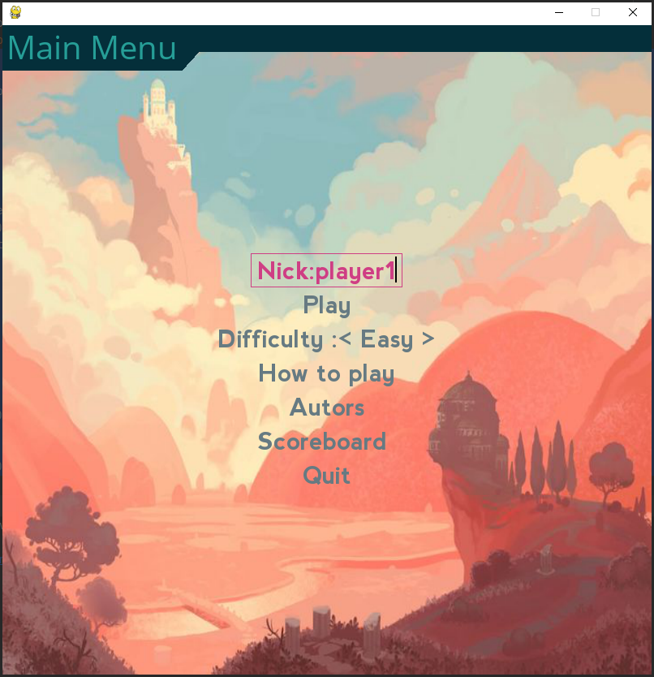
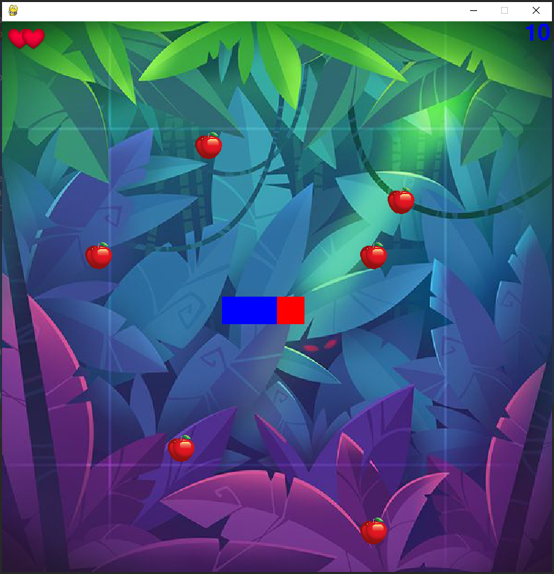

# Snake
## Author: Roch Kalemba

### Description
Clone one of popular arcade games. Game has three levels of dificulty: easy, hard and illusion. You might know this game Snake
# Rules
1. Don't hit yourself or game edge
2. Collect apples increasing  your score

### Technologies
**pygame** package in python 3.7.9 

### How to run this app?
1. Clone the template project: 
`git clone  https://github.com/Roch-git/Python_Game.git Snake`
`cd Snake `
2. Install the project's development and runtime requirements:
`pip install -r requirements.txt`
3. Run game
`python game.py`

# Screenshots

